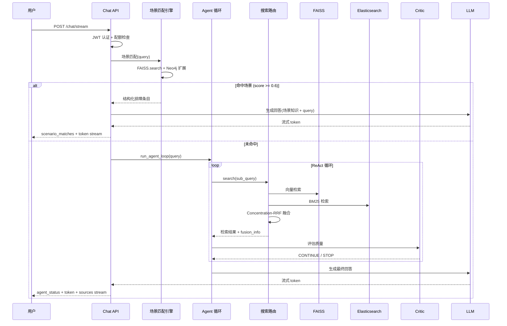
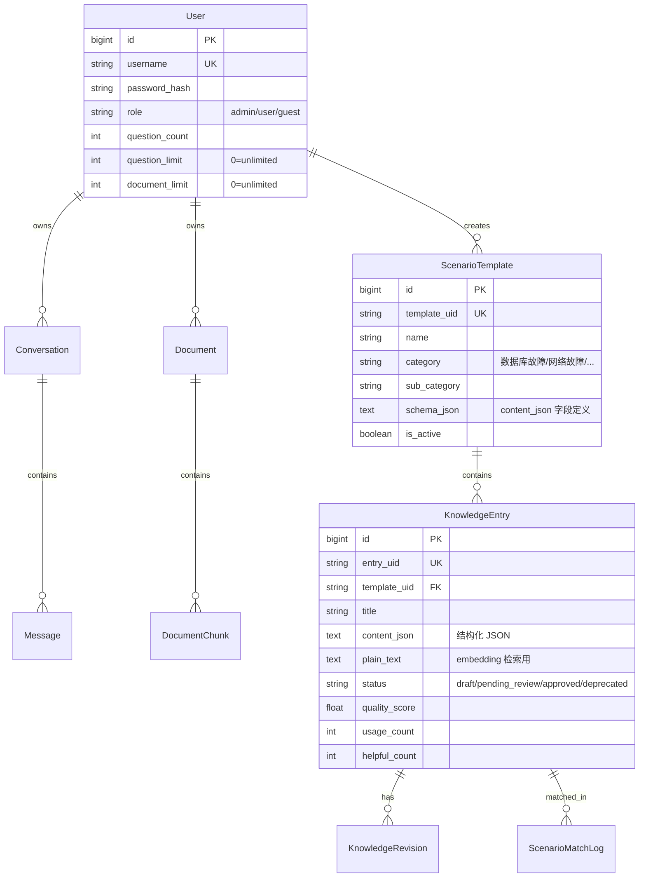

# Mini Agent — 智能运维排障知识库

基于 ReAct Agent 循环的场景知识库系统。将运维排障经验结构化沉淀，通过 **场景匹配 → RAG 检索 → Agent 决策 → 联网搜索** 四级链路，从提问到答案全流程自主编排。

> [!IMPORTANT]
> 本仓库不包含可用密钥、真实凭据或业务数据。请复制 `.env.example` 到 `.env` 后在本地配置，不要提交 `.env`。生产部署前请阅读 [安全政策](SECURITY.md)。

---

## 目录

1. [项目背景](#1-项目背景)
2. [核心架构](#2-核心架构)
3. [完整技术链路：从提问到答案](#3-完整技术链路从提问到答案)
4. [场景知识库子系统](#4-场景知识库子系统)
5. [Agent 自主决策循环](#5-agent-自主决策循环)
6. [三层召回与 RRF 融合](#6-三层召回与-rrf-融合)
7. [关键技术设计](#7-关键技术设计)
8. [数据模型](#8-数据模型)
9. [项目结构](#9-项目结构)
10. [部署与运行](#10-部署与运行)
11. [安全与隐私](#11-安全与隐私)

---

## 1. 项目背景

### 1.1 痛点分析

IT 运维团队日常处理大量故障工单，核心痛点：

| 痛点 | 表现 |
|------|------|
| **经验断层** | 排障经验存储在个人脑中，核心人员离职即流失 |
| **重复踩坑** | 相似故障每次从头排查，无法复用历史经验 |
| **检索低效** | 历史工单/文档堆砌，关键词检索难以精准匹配故障场景 |
| **新人上手慢** | 缺乏结构化排障指引，依赖老员工传帮带 |

### 1.2 从 RAG 到场景知识库

传统 RAG 以文档为中心（文档 → chunk → 检索 → 生成），适合"从文档中找答案"。但运维排障需要的是**结构化经验条目**——故障现象 → 根因 → 解决步骤 → 预防措施。

本系统将 **场景知识库** 作为第一优先级检索源，**本地文档** 作为基础检索层，**联网搜索** 作为兜底保障：

```
用户提问
  ↓
① 场景匹配引擎（FAISS 语义匹配 + Neo4j 图谱扩展）
  ├── 命中（score ≥ 0.6）→ 结构化排障卡片 + 场景感知过滤无关文档
  └── 未命中 → 继续
        ↓
② 本地文档检索（DocSummary + FAISS 向量 + ES BM25 + Concentration-RRF 融合）
  ├── 结果充足（集中度 ≥ 0.5）→ Agent 综合回答
  ├── 结果一般（集中度 0.3~0.5）→ Agent 循环再检索
  └── 结果不足（集中度 < 0.3 或零命中）
        ├── 已开启联网搜索 → ③ 直接联网搜索 + LLM 整合 [网络搜索]
        └── 未开启联网搜索 → 降级为通用知识 [通用知识]
```

**核心原则**：开启联网搜索时，本地结果不足 → **直接联网**，不走降级到通用知识的弯路。联网搜索结果交给 LLM 整合生成带标注的回答，而非生硬拼接原始片段。

### 1.3 场景知识库 vs 传统 RAG

| | 传统 RAG | 场景知识库 |
|---|---|---|
| 数据组织 | 文档 → chunk（无结构） | 场景模板 → 知识条目（结构化 JSON） |
| 检索目标 | 相关文本片段 | 精确匹配的排障方案 |
| 知识质量 | 依赖文档质量 | 人工审核 + 版本管理 + 反馈机制 |
| 回答形式 | LLM 自由生成 | 结构化卡片 + LLM 增强解释 |
| 知识演进 | 文档覆盖即覆盖 | 图谱关联 + 使用反馈驱动优化 |

---

## 2. 核心架构

### 2.1 整体架构图

~~~text
【前端层】
  Web UI（SSE 流式渲染）
       │
       ▼
【API 层】
  JWT + RBAC 认证
       │
       ├── 对话路由（SSE Stream）
       │        │
       │        ▼
       │   【Agent 决策层】
       │     Query 分类（chitchat / shallow / deep）
       │        │
       │        ▼
       │     ReAct 循环（Think → Act → Observe）
       │        │
       │        ▼
       │   【检索层】
       │     场景匹配（FAISS + Neo4j）
       │        │ 未命中
       │        ▼
       │     DocSummaryIndex（文档级语义）
       │        ▼
       │     FAISS（chunk 级语义）
       │        ▼
       │     Elasticsearch（BM25 关键词）
       │        ▼
       │     Concentration-RRF（自适应融合）
       │        ▼
       │     BGE Reranker（Cross-Encoder 精排）
       │        │
       │        ▼
       │     Critic 评估（完整性 / 可靠性 / 信息增益）
       │        ├── 信息不足 ──▶ 返回 ReAct 继续检索
       │        └── 评估满足 ──▶ 4 级降级保障 / 回答输出
       │
       └── 知识库路由（CRUD + 审核）
                │
                ▼
          【知识管理层】
            场景模板 → 知识条目
                         ├──▶ Neo4j 知识图谱
                         ├──▶ 修订历史
                         └──▶ 场景匹配引擎

【基础设施】
  MySQL 8.0 · Redis 7 · MinIO · Kafka · Apache Tika
~~~

### 2.2 技术栈

| 层级 | 技术 | 说明 |
|------|------|------|
| Web 框架 | FastAPI + Uvicorn | 异步 HTTP + SSE 流式 |
| LLM | OpenAI 兼容接口 | DeepSeek / GPT / 通义千问 |
| Embedding | DashScope text-embedding-v4 | 1024 维向量 |
| 向量检索 | FAISS IndexFlatIP | 余弦相似度（内积） |
| 全文检索 | Elasticsearch 8.x | BM25 + IK 中文分词 |
| 图数据库 | Neo4j 5 Community | 知识图谱关联 |
| 关系数据库 | MySQL 8.0 + SQLAlchemy | 结构化数据 |
| 缓存 | Redis 7 | 搜索缓存 + 会话缓存 |
| Reranker | BAAI/bge-reranker-v2-m3 | Cross-Encoder 精排 |
| 文档解析 | Apache Tika + HanLP | PDF/Word/PPT/Excel 文本提取 |
| 消息队列 | Apache Kafka | 文档解析任务分发 |
| 对象存储 | MinIO | 文档存储 |
| 前端 | 原生 HTML/CSS/JS | Marked.js + Mermaid.js + Highlight.js |

---

## 3. 完整技术链路：从提问到答案

本节以运维场景"MySQL 连接超时怎么办"为例，详解从用户提问到最终回答的完整技术链路。

### 3.1 阶段一：请求准入 (0ms)

```
POST /chat/stream  { message, conversation_id, web_search }
    │
    ├── 1. JWT 认证 → 提取 user_id, role
    ├── 2. 游客配额检查 → question_count >= limit → 403
    ├── 3. 游客计数 +1
    └── 4. 创建/复用 Conversation
```

**技术要点**：
- JWT 使用 HMAC-SHA256 自签名，payload 包含 `{sub, username, role, iat, exp}`
- 密码存储：PBKDF2-HMAC-SHA256，60 万次迭代，32 字节随机盐

### 3.2 阶段二：场景知识库预匹配 (~80ms)

**这是区别于传统 RAG 的关键步骤。** 在进入 Agent 循环之前，先用场景匹配引擎快速判断是否命中排障知识库。

```
query = "MySQL 连接超时怎么办"
    │
    ├── 1. Embedding(query) → 1024 维向量
    ├── 2. FAISS.search(vector, k=15) → 15 个候选条目
    ├── 3. 阈值过滤: cosine_similarity > 0.55（可配置）
    ├── 4. 状态过滤: status="approved" + 所属模板 is_active=True
    ├── 5. Neo4j 图谱扩展:
    │      MATCH (a:KnowledgeEntry)-[r]->(b:KnowledgeEntry)
    │      WHERE a.entry_uid IN $matched_uids
    │      RETURN b ORDER BY sum(r.weight) DESC
    │      → 召回关联条目（如"连接池配置"、"max_connections 调优"）
    └── 6. 排序取 top_k=5
```

**注意**：停用的场景模板（`is_active=False`）其知识条目会从 FAISS 索引中排除，不会被检索到。管理员可通过前端"启用/停用"按钮控制。

**匹配结果**：

```json
{
  "entries": [{
    "entry_uid": "entry_a1b2c3d4",
    "title": "MySQL Too many connections 超限",
    "similarity_score": 0.92,
    "content_json": {
      "symptoms": ["连接超时", "Too many connections"],
      "root_cause": "连接数超过 max_connections 限制",
      "solution_steps": [
        "SHOW PROCESSLIST 查看当前连接数",
        "SET GLOBAL max_connections = 500",
        "持久化到 /etc/my.cnf"
      ],
      "severity": "P2"
    }
  }]
}
```

**如果命中（score ≥ 0.6）**：将结构化条目注入 LLM 上下文，启用场景感知过滤（提取场景关键术语，过滤文档检索中不相关的碎片），以场景知识为主、文档为辅生成回答。

**如果未命中**：进入阶段三，走传统 RAG 三层召回。

### 3.3 阶段三：Query 分类与路由 (~200ms)

```
query → LLM 分类器
    │
    ├── chitchat（闲聊）
    │     "你好"、"今天天气怎么样"
    │     → 跳过检索，直接 LLM 回答
    │
    ├── shallow（简单事实查询）
    │     "MySQL 默认端口是多少"
    │     → max_rounds=2, 可用工具: search + web_search
    │
    └── deep（复杂分析查询）
          "为什么我们的 MySQL 主从延迟突然变大，如何排查"
          → max_rounds=3, 可用工具: search + analysis + web_search + generation
```

**技术要点**：
- 分类器使用 **正则预检 + LLM 确认** 两级策略，减少 LLM 调用
- 分类结果决定 Agent 的 `max_rounds`、`allowed_tool_categories`、`degradation_max_level`
- 前端 `web_search=true` 时强制分类为 deep，确保联网搜索工具可用

### 3.4 阶段四：Agent ReAct 自主决策循环

```
Round 1:
  Think: 需要检索 MySQL 连接超时的根因和解决方案
  Act: search("MySQL 连接超时 主从延迟 排查")
  Observe: 得到 15 个 chunk 结果，信息增益 0.72
  Critic: 根因分析已完整，但缺少具体配置参数 → CONTINUE

Round 2:
  Think: 需要补充 max_connections 和 wait_timeout 相关配置
  Act: search("MySQL max_connections wait_timeout 配置优化")
  Observe: 得到 8 个新 chunk，信息增益 0.31
  Critic: 信息完整，解答充分 → STOP
```

**4 层终止条件**：

| 层级 | 条件 | 说明 |
|------|------|------|
| L1 | round >= max_rounds | 硬上限，防止死循环 |
| L2 | consecutive_non_search_rounds >= 2 | 连续非检索轮次 |
| L3 | 连续 2 轮 info_gain < 0.15 | 新信息不足，继续无意义 |
| L4 | Critic 连续 STOP 决策 | LLM 自评认为信息已充分 |

### 3.5 阶段五：三层召回

每次 Agent 调用 `search(query)` 工具时，触发三层召回管线：

```
search("MySQL 连接超时 主从延迟 排查")
    │
    ├── Layer 0: 跨语言改写（检测中文实体 → 生成英文/拼音变体）
    │     "MySQL connection timeout master-slave replication lag"
    │
    ├── Layer 1: DocSummaryIndex（文档级语义检索）
    │     对每个文档的摘要做 embedding → 快速定位相关文档
    │     → 对命中文档内的 chunk 做分数提升
    │
    ├── Layer 2: FAISS 向量检索（chunk 级语义）
    │     query embedding → IndexFlatIP.search(k=30)
    │     → 余弦相似度归一化分数
    │
    ├── Layer 3: Elasticsearch BM25（chunk 级关键词）
    │     query → IK 分词 → BM25 评分
    │     → 项目术语同义词扩展（如 "连接池" ↔ "connection pool"）
    │
    └── Concentration-RRF 融合
```

### 3.6 阶段六：Concentration-RRF 融合算法

**核心思想**：传统 RRF 对所有召回源一视同仁，但不同 query 在各召回源上的"专注度"不同。Concentration-RRF 用**文档集中度**作为自适应权重。

```
输入: FAISS_results (30条), ES_results (30条)

Step 1 — 绝对质量门控:
  FAISS: cosine > 0.40 才保留
  ES:    BM25 > 3.0 才保留

Step 2 — 文档集中度计算:
  统计各召回源结果中的文档分布，计算归一化熵:
    concentration = 1 - (entropy / log(N))
  集中度越高 → 该召回源越"确定" → 权重越高

Step 3 — 自适应 RRF 融合:
  对每个 chunk:
    rrf_score = Σ (concentration_i / (k + rank_i))
    其中 k=60, concentration_i 为召回源 i 的集中度

Step 4 — DocSummaryIndex 提升:
  对位于 DocSummary 命中文档内的 chunk: score *= 1.2

Step 5 — BGE Reranker 精排:
  Cross-Encoder(query, chunk) → 相关性分数
  与 RRF 分数加权合并，取 top_10
```

### 3.7 阶段七：Critic 检索质量评估

```
Critic 评估 (两层机制):

Layer 1 — 信号驱动评估 (0ms, 无需 LLM):
  ├── novel_ratio: 本轮新增 chunk 数 / 本轮总 chunk 数
  ├── avg_cosine: 平均余弦相似度
  ├── quality_label: "empty" / "low" / "medium" / "good"
  └── 快速判断: empty → 触发降级; good → 跳过 LLM Critic

Layer 2 — LLM Critic 自省 (~500ms):
  评估维度:
  ├── completeness: 是否覆盖了问题的所有方面
  ├── groundedness: 回答是否有检索结果支撑
  └── uncertainties: 文档未覆盖的知识盲区
  输出:
  ├── CONTINUE: 需要再搜一轮
  └── STOP: 信息充分，可以生成回答

信息增益计算:
  info_gain = |本轮新 chunk_uid ∩ 历史 seen_chunk_uids| / 本轮总数
  连续 2 轮 info_gain < 0.15 → 触发 L3 终止
```

### 3.8 阶段八：搜索优先级与降级保障

```
本地检索质量判定（基于文档集中度）：
  ├── 集中度 ≥ 0.5 → 质量好，直接生成回答
  ├── 集中度 0.3~0.5 → 质量一般，Agent 循环再检索
  └── 集中度 < 0.3 或零命中 → 质量不足
          │
          ├── 已开启联网搜索？
          │     YES → 直接联网搜索 + LLM 整合回答 [网络搜索]
          │           联网也无结果 → 降级为通用知识 [通用知识]
          │
          └── 未开启联网搜索？
                NO → 降级链：
                      Level 0: 诚实声明 "文档库未找到相关内容"
                      Level 1: LLM 通用知识回答 [通用知识]
                      Level 2: 自动联网搜索兜底（仅 DEEP 分类）
                               → LLM 整合网络结果 [网络搜索]
```

**关键设计**：
- 开启联网搜索时，本地不足 → **直接联网**，不走降级到通用知识的弯路
- 联网搜索结果**交给 LLM 整合**，生成完整带标注的回答，而非生硬拼接原始片段
- 场景知识库中的**停用模板**从 FAISS 索引中排除，停用后不会被检索到

### 3.9 阶段九：回答生成与 SSE 流式推送

```
最终回答生成:
  System Prompt (含场景知识库匹配结果 + 检索上下文)
    +
  Agent 历史 (轮次、Critic 评估、不确定项)
    +
  用户问题
    ↓
  LLM stream → SSE 逐 token 推送前端

SSE 事件类型:
  {"type": "scenario_matches", "entries": [...]}   # 场景知识卡片
  {"type": "agent_status", "content": "..."}        # Agent 思考过程
  {"type": "token", "content": "..."}               # LLM 流式 token
  {"type": "sources", "sources": [...]}             # 引用来源
  {"type": "error", "content": "..."}               # 错误
  data: [DONE]                                      # 流结束
```

### 3.10 完整链路时序图



---

## 4. 场景知识库子系统

### 4.1 数据模型

#### 场景模板（ScenarioTemplate）

定义排障知识的一级/二级分类结构。

| 字段 | 类型 | 说明 |
|------|------|------|
| template_uid | VARCHAR(64) PK | 模板唯一标识 |
| name | VARCHAR(255) | 场景名称，如"MySQL 连接超时" |
| category | VARCHAR(128) | 一级分类：数据库故障/网络故障/应用故障/基础设施/中间件 |
| sub_category | VARCHAR(128) | 二级分类，如"MySQL"、"Redis" |
| schema_json | TEXT | 知识条目结构定义（JSON Schema），约束 content_json 字段 |
| tags | VARCHAR(512) | 逗号分隔标签 |

**预置分类**：

| 一级分类 | 二级分类示例 | 典型场景 |
|----------|-------------|---------|
| 数据库故障 | MySQL / Redis / ES / MongoDB | 连接超时、主从延迟、OOM、死锁 |
| 网络故障 | DNS / LB / 防火墙 / CDN | DNS 解析失败、端口不通、SSL 过期 |
| 应用故障 | Java / Python / Go / Node | OOM Kill、线程池满、GC 频繁 |
| 基础设施 | K8s / Docker / 磁盘 / CPU | CrashLoopBackOff、磁盘满、CPU 飙高 |
| 中间件 | Kafka / RabbitMQ / Nginx | 消息积压、Consumer 掉线、502 |

#### 知识条目（KnowledgeEntry）— 核心表

| 字段 | 类型 | 说明 |
|------|------|------|
| entry_uid | VARCHAR(64) PK | 条目唯一标识 |
| template_uid | VARCHAR(64) FK | 关联场景模板 |
| title | VARCHAR(512) | 条目标题 |
| content_json | TEXT | **结构化排障知识（JSON）** |
| plain_text | TEXT | 纯文本版（用于 embedding 检索） |
| status | VARCHAR(32) | draft / pending_review / approved / deprecated |
| quality_score | FLOAT | 质量评分 0-5 |
| usage_count | INTEGER | 被检索命中次数 |
| helpful_count | INTEGER | 用户"有帮助"反馈次数 |

**content_json 结构示例**：

```json
{
  "symptoms": ["应用日志报 Too many connections", "连接超时 > 3s"],
  "environment": {
    "os": "Ubuntu 22.04",
    "version": "MySQL 8.0.35",
    "config": { "max_connections": 151 }
  },
  "root_cause": "业务并发突增导致连接数超过 max_connections 上限",
  "solution_steps": [
    "临时：SET GLOBAL max_connections = 500",
    "持久化：修改 /etc/my.cnf → max_connections=500",
    "重启 MySQL 服务"
  ],
  "prevention": [
    "配置 HikariCP/Druid 连接池最大值 ≤ max_connections * 0.8",
    "设置 wait_timeout=600 秒自动回收空闲连接",
    "Prometheus 监控 SHOW PROCESSLIST 连接数趋势"
  ],
  "severity": "P2",
  "estimated_fix_time": "15 分钟",
  "related_entries": ["entry_xxx_mysql_pool", "entry_xxx_conn_leak"]
}
```

### 4.2 知识图谱（Neo4j）

**为什么用图数据库**：MySQL 做"查找与条目 A 关联的所有条目，以及它们与条目 B 的共同关联"需要多层递归 JOIN，复杂度 O(n^depth)。Neo4j 的 Cypher 查询天然适合图遍历。

**节点设计**：
```cypher
(:KnowledgeEntry {
    entry_uid: "entry_a1b2c3d4",
    title: "MySQL Too many connections 超限",
    template_uid: "tmpl_mysql_conn"
})
```

**关系类型**：

| 关系 | 含义 | 示例 |
|------|------|------|
| `RELATED_TO` | 通用关联 | MySQL 连接超限 → HikariCP 连接池配置 |
| `CAUSED_BY` | 因果关系 | 主从延迟 → binlog 写入慢 |
| `PREREQUISITE_OF` | 前置知识 | 理解 max_connections → 理解连接池配置 |
| `SIMILAR_TO` | 相似场景 | MySQL 连接超限 ≈ PostgreSQL 连接超限 |
| `ACCOMPANIED_BY` | 伴随现象 | Too many connections → CPU 飙高 |

**图谱扩展匹配**：
```
场景匹配命中 [entry_A, entry_B]
  → Neo4j: MATCH (a)-[r]->(b) WHERE a IN [A,B] AND b NOT IN [A,B]
  → 返回 r.weight 最高的 10 个关联条目
  → 注入 LLM 上下文（similarity_score=0.5，排序时排在直接匹配之后）
```

### 4.3 审核与版本管理

```
知识条目生命周期:
  draft → pending_review → approved → (deprecated)
              ↓ 驳回
            draft

版本管理:
  每次 PUT /api/knowledge/{uid} 更新时:
  1. 保存当前 content_json 快照 → knowledge_revision 表
  2. revision_number 自增
  3. 支持 POST /api/knowledge/{uid}/revisions/{n}/rollback 回滚
```

### 4.4 场景匹配引擎

```python
class ScenarioMatcher:
    def match(self, db, query, top_k=5, threshold=0.75) -> dict:
        # 1. Query embedding (DashScope text-embedding-v4, 1024 维)
        q_vec = embedding_service.embed_texts([query])

        # 2. FAISS IndexFlatIP 搜索 (内积 = 余弦相似度)
        scores, ids = faiss_index.search(q_vec, k=top_k * 3)

        # 3. 阈值 + status 过滤
        candidates = [entry for entry in db_entries
                      if score > threshold and entry.status == "approved"]

        # 4. Neo4j 图谱扩展
        expanded_uids = neo4j.get_expanded_match([e.uid for e in candidates])
        candidates += expanded_entries_from_db(expanded_uids)

        # 5. 排序取 top_k
        candidates.sort(key=lambda x: x.similarity_score, reverse=True)
        return {"entries": candidates[:top_k], "elapsed_ms": ...}
```

FAISS 索引通过 `ScenarioMatcher.rebuild_index()` 全量重建（从 MySQL 读取所有 approved 条目），`index_entry()` 增量更新。

---

## 5. Agent 自主决策循环

### 5.1 AgentState

```python
@dataclass
class AgentState:
    user_query: str                          # 用户原始问题
    classification: ClassificationResult      # Query 分类结果
    round: int = 0                           # 当前轮次
    max_rounds: int = 1                      # 最大轮次（由分类决定）
    search_results: list[dict]               # 当前轮检索结果
    all_results: list[dict]                  # 累积所有轮次结果
    seen_chunk_uids: set[str]                # 已见过的 chunk（去重）
    critic_history: list[CriticAssessment]   # Critic 评估历史
    scenario_matches: list[dict]             # 场景知识库匹配结果
    degradation_triggered: bool              # 是否触发降级
    force_web_search: bool                   # 前端强制联网
    final_answer: str                        # 最终回答
    timings: dict[str, float]                # 各阶段耗时统计
```

### 5.2 工具注册

Agent 使用 Function Calling（兼容 OpenAI tool_call 协议）：

| 工具 | 函数 | 分类可用性 |
|------|------|-----------|
| `search` | 调用三层召回管线 | 全部 |
| `rewrite_query` | LLM 查询改写 | deep |
| `analyze_signals` | 信号分析（信息增益/质量评估） | deep |
| `web_search` | 联网搜索 | shallow, deep |
| `generate_document` | 生成 PPT/Word/PDF | deep |
| `generate_answer` | 调用 LLM 生成最终回答 | 全部 |
| `stop` | 主动终止循环 | 全部 |

### 5.3 Think-Act-Observe 流程

```
Round N:
  ┌─ Think ─────────────────────────────────────────────┐
  │ LLM 分析当前状态，决定下一步行动:                      │
  │   - "信息不足，需要搜索 X" → 选择 search 工具         │
  │   - "需要从互联网获取最新信息" → 选择 web_search       │
  │   - "信息充分，可以回答" → 选择 generate_answer        │
  └─────────────────────────────────────────────────────┘
  ┌─ Act ───────────────────────────────────────────────┐
  │ 执行选定的工具函数:                                   │
  │   search(query) → 触发三层召回 + RRF + Rerank        │
  │   web_search(query) → Bing/DuckDuckGo API            │
  │   generate_answer() → LLM 流式生成                   │
  └─────────────────────────────────────────────────────┘
  ┌─ Observe ───────────────────────────────────────────┐
  │ 处理工具返回结果:                                     │
  │   - 更新 seen_chunk_uids（去重）                      │
  │   - 计算 info_gain（新增信息比例）                     │
  │   - 累积 all_results                                 │
  └─────────────────────────────────────────────────────┘
  ┌─ Critic ────────────────────────────────────────────┐
  │ 评估当前信息质量:                                     │
  │   Layer 1: 信号驱动（cosine 均值 / info_gain）        │
  │   Layer 2: LLM 评估（completeness / groundedness）    │
  │   决策: CONTINUE（再搜一轮） / STOP（生成回答）        │
  └─────────────────────────────────────────────────────┘
```

---

## 6. 三层召回与 RRF 融合

### 6.1 DocSummaryIndex — 文档级语义检索（Layer 1）

**设计动机**：传统的 chunk 级检索只看局部片段，忽略了文档整体主题。例如一篇《MySQL 高可用方案》文档中，"连接超时"相关的 chunk 可能得分不高，但整篇文档的主题高度相关。

```
offline:
  对每篇文档的前 2000 字生成 embedding → numpy matrix (N_docs × 1024)

online:
  query embedding → numpy dot product → 找出 top_k 相关文档
  → 对这些文档内的 chunk，RRF 分数乘以 1.2 提升
```

### 6.2 FAISS 向量检索 — chunk 级语义（Layer 2）

```
IndexFlatIP: 内积 = 余弦相似度（向量已 L2 归一化）
dim=1024, ntotal=文档 chunks 数量

优势: 对同义词、语义相近但用词不同的查询有良好召回
局限: 对精确关键词匹配（如错误码 "ERR_CONN_TIMEOUT"）可能不如 BM25
```

### 6.3 ES BM25 — chunk 级关键词（Layer 3）

```
IK 分词器 + 项目术语同义词词典:

synonyms.txt:
  "连接池, connection pool, 连接池配置"
  "主从复制, master-slave, replication"
  "死锁, deadlock, 锁等待"

BM25 公式:
  score(D,Q) = Σ IDF(qi) × (f(qi,D) × (k1+1)) / (f(qi,D) + k1 × (1-b+b×|D|/avgdl))

优势: 精确匹配错误码、配置参数名、命令名
```

### 6.4 Concentration-RRF 融合

**公式**：

```
Step 1 — 质量门控:
  FAISS: keep if cosine > 0.40
  ES:    keep if BM25 > 3.0

Step 2 — 文档集中度:
  concentration_i = 1 - H(i) / log(N_docs)
  其中 H(i) = -Σ (doc_chunk_ratio × log(doc_chunk_ratio))
  含义: 该召回源的结果集中在少数文档 → 更可信 → 权重更高

Step 3 — 自适应 RRF:
  rrf_score(chunk) = Σ_i concentration_i / (k + rank_i(chunk))
  k=60（平滑参数）

Step 4 — 最终融合:
  score = α × rrf_score + (1-α) × reranker_score
  α=0.6（RRF 为主，Reranker 为辅）
```

**与传统 RRF 的对比**：
- 传统 RRF：等权重 `1/(k+rank)`，无法区分召回源质量
- Concentration-RRF：文档集中度作为自适应权重，自然筛选高质量召回源

---

## 7. 关键技术设计

### 7.1 跨语言查询改写

中文运维环境中的实体名称（"安克创新"→"Anker"、"中控技术"→"Supcon"）在英文文档中可能以英文名出现。

```
检测中文实体 → LLM 翻译为英文/拼音变体
  "安克创新的 MySQL 配置" → 追加检索 "Anker MySQL configuration"
  → 两轮检索结果合并去重 → RRF 融合
```

### 7.2 搜索缓存

```
Cache Key: MD5(query + owner_id)
Cache TTL: 7 天（可配置）
失效策略: 
  - 用户上传新文档 → Kafka 发送缓存失效消息 → 清除相关 key
  - 文档删除 → 同上
存储: Redis, fallback to MySQL
```

### 7.3 信息增益追踪

```
Round N 的信息增益 = |seen_chunk_uids_N - seen_chunk_uids_{N-1}| / total_chunks_N

含义: 本轮检索引入了多少"新"信息
阈值: 连续 2 轮 info_gain < 0.15 → 检索收益递减 → 终止循环
```

### 7.4 话题切换感知

传统 RAG 容易把上一轮的检索上下文带入本轮，导致两个不相关的问题之间互相干扰。

```
Agent System Prompt 中注入指令：
  "用户可能在不同消息中讨论不同话题。
   如果检索到的文档与当前问题不相关，不要强行关联——
   直接基于通用知识回答，标注为 [通用知识]。"
```

---

## 8. 数据模型

### 8.1 核心表关系



### 8.2 Neo4j 图模型

```
(:KnowledgeEntry {entry_uid, title, template_uid})
    -[:RELATED_TO {weight}]-> (:KnowledgeEntry)
    -[:CAUSED_BY {weight}]-> (:KnowledgeEntry)
    -[:PREREQUISITE_OF {weight}]-> (:KnowledgeEntry)
    -[:SIMILAR_TO {weight}]-> (:KnowledgeEntry)
    -[:ACCOMPANIED_BY {weight}]-> (:KnowledgeEntry)
```

---

## 9. 项目结构

```
mini_agent/
├── app/
│   ├── agent/                        # Agent ReAct 自主决策循环
│   │   ├── agent_loop.py             # 核心循环: Think→Act→Observe→Critic→Terminate
│   │   ├── classifier.py             # Query 分类器 (chitchat/shallow/deep)
│   │   ├── critic.py                 # 检索质量评估 + 信息增益
│   │   ├── degradation.py            # 4 级降级链路
│   │   └── tool_registry.py          # Agent 工具注册
│   │
│   ├── api/
│   │   ├── dependencies.py           # get_current_user / get_current_admin
│   │   └── routes/
│   │       ├── auth.py               # 登录/注册/游客
│   │       ├── chat.py               # SSE 流式对话
│   │       ├── document.py           # 文档上传/管理
│   │       ├── admin.py              # 系统管理
│   │       └── scenario.py           # 场景知识库 CRUD + 匹配
│   │
│   ├── core/
│   │   ├── config.py                 # 全局配置 (Pydantic Settings)
│   │   ├── auth.py                   # JWT + PBKDF2 密码哈希
│   │   ├── database.py               # SQLAlchemy 引擎
│   │   ├── neo4j.py                  # Neo4j 图数据库客户端
│   │   ├── redis_client.py           # Redis 客户端
│   │   └── time_utils.py             # Asia/Shanghai 时区
│   │
│   ├── models/                       # SQLAlchemy ORM
│   │   ├── user.py                   # 用户 (admin/user/guest)
│   │   ├── conversation.py           # 会话
│   │   ├── message.py                # 消息
│   │   ├── document.py               # 文档
│   │   ├── document_chunk.py         # 文档分块
│   │   ├── scenario.py               # 场景模板 + 知识条目 + 匹配日志 + 修订历史
│   │   └── ...
│   │
│   ├── services/                     # 业务逻辑层
│   │   ├── chat_service.py           # 对话编排 (Agent + 场景匹配 + SSE)
│   │   ├── scenario_service.py       # 场景知识库 CRUD + 审核 + 图谱
│   │   ├── scenario_matcher.py       # FAISS 场景匹配引擎
│   │   ├── search_router.py          # 搜索路由 + Concentration-RRF
│   │   ├── hybrid_search.py          # 混合检索
│   │   ├── vector_store.py           # FAISS 向量存储
│   │   ├── es_service.py             # Elasticsearch BM25
│   │   ├── reranker_service.py       # BGE Reranker
│   │   ├── doc_summary_index.py      # 文档摘要索引
│   │   ├── web_search_service.py     # 联网搜索 (Bing/DuckDuckGo/Brave)
│   │   └── ...
│   │
│   ├── repository/                   # 数据访问层
│   │   ├── scenario_repo.py          # 场景知识库 Repository
│   │   └── ...
│   │
│   ├── schemas/                      # Pydantic 请求/响应
│   │   ├── scenario.py               # 场景知识库 Schemas
│   │   └── ...
│   │
│   └── main.py                       # FastAPI 入口 + 生命周期
│
├── templates/
│   ├── index.html                    # 主界面 (含知识库管理面板)
│   └── login.html                    # 登录页
│
├── data/
│   ├── faiss/                        # 文档 chunk FAISS 索引
│   └── scenario_faiss/               # 场景知识条目 FAISS 索引
│
├── docker-compose.prod.yml           # 生产部署
├── Dockerfile
├── requirements.txt
└── run.py
```

---

## 10. 部署与运行

### 10.1 环境要求

| 组件 | 版本 | 必需 |
|------|------|------|
| Python | 3.11+ | ✅ |
| MySQL | 8.0 | ✅ |
| Redis | 7.x | ✅ |
| Neo4j | 5 Community | 推荐（知识图谱） |
| Elasticsearch | 8.15+ | 推荐（BM25 检索） |
| Kafka | 3.x | 可选（异步文档解析） |
| Tika Server | 2.x | 可选（文档解析） |

### 10.2 Docker 部署

```bash
# 1. 配置环境变量
cp .env.example .env
# 编辑 .env，为密码、JWT Secret 和 API Key 填入独立强随机值

# 2. 启动 Neo4j（知识图谱）
# 将 <strong-random-password> 替换为强随机密码，并在 .env 配置相同的 NEO4J_PASSWORD
docker run -d --name neo4j \
  -p 7474:7474 -p 7687:7687 \
  -e NEO4J_AUTH=neo4j/<strong-random-password> \
  neo4j:5-community

# 3. 启动应用
docker compose -f docker-compose.prod.yml up -d

# 4. 访问
# http://<服务器IP>:8000/login
```

### 10.3 本地开发

```bash
pip install -r requirements.txt
# 确保 MySQL / Redis 已运行
python run.py
# http://127.0.0.1:8000
```

### 10.4 初始化知识库

管理员登录后 → 点击 Header "知识库"按钮 → 创建场景模板 → 添加知识条目 → 审核通过 → 条目自动加入 FAISS 索引 → 用户提问即可命中。

---

## 11. 安全与隐私

- `.env`、私钥、日志、上传文件、索引、数据库目录与本地归档已被 Git 忽略。
- `.dockerignore` 阻止上述内容进入 Docker 构建上下文和镜像。
- `.env.example` 只是配置模板；所有占位符都必须在本地替换，且不应复用其他系统的凭据。
- 不要在 Issue、截图或调试日志中公开真实邮箱、内网地址、用户数据或请求头。
- 如发现漏洞，请按 [SECURITY.md](SECURITY.md) 使用私密报告渠道。

---

## 技术路线总结

```
从提问到答案的完整技术链路:

用户提问
  │
  ├─ [JWT 认证 + RBAC 鉴权 + 配额检查] ────────── 安全准入层
  │
  ├─ [场景知识库预匹配] ───────────────────────── 场景优先层
  │   ├── Embedding(query) → FAISS 语义匹配
  │   ├── Neo4j 图谱扩展召回关联条目
  │   ├── 仅检索 is_active=True 的模板下的 approved 条目
  │   └── 命中 → 结构化排障卡片 + 场景感知过滤无关文档
  │
  ├─ [Query 分类] ─────────────────────────────── 智能路由层
  │   └── 闲聊/简单事实/复杂分析 → 不同策略
  │
  ├─ [Agent ReAct 循环] ──────────────────────── 自主决策层
  │   ├── Think: 分析信息缺口，选择工具
  │   ├── Act: 执行 search/web_search/generate
  │   ├── Observe: 计算信息增益，更新状态
  │   └── Critic: 评估质量，CONTINUE/STOP
  │
  ├─ [三层召回 + Concentration-RRF] ──────────── 检索融合层
  │   ├── DocSummaryIndex: 文档级语义定位
  │   ├── FAISS: chunk 级向量语义
  │   ├── ES: chunk 级 BM25 关键词
  │   ├── Concentration-RRF: 自适应融合
  │   └── BGE Reranker: Cross-Encoder 精排
  │
  ├─ [搜索优先级与降级] ──────────────────────── 兜底容错层
  │   ├── 本地充足 → 直接回答
  │   ├── 本地不足 + 已开联网 → 直接联网 + LLM 整合 [网络搜索]
  │   └── 本地不足 + 未开联网 → 通用知识 [通用知识]
  │
  └─ [SSE 流式回答 + 结构化卡片] ────────────── 输出渲染层
      └── 逐 token 推送 + 来源引用 + 排障卡片
```
